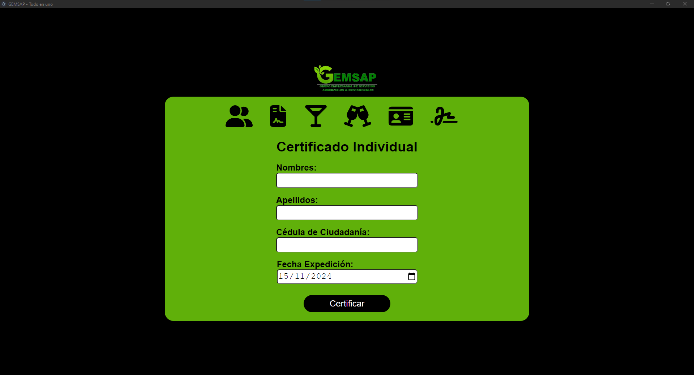

# Gemsap Generator

**Gemsap Generator** es una aplicación de escritorio diseñada para agilizar la generación de certificados y documentos relacionados para instituciones educativas y empresas. Con una interfaz intuitiva, permite crear documentos personalizados a partir de plantillas predefinidas, generando archivos en PDF con QR únicos y adaptables a diversas necesidades.  

Además, ofrece la posibilidad de gestionar las firmas electrónicas de manera centralizada, asegurando consistencia y profesionalismo en cada documento emitido.

---

## Características

- Generación de certificados y carnets en formatos personalizados.
- Soporte para plantillas en formatos `.docx` y `.xlsx`.
- Generación automática de códigos QR únicos en cada documento.
- Organización de documentos generados en carpetas específicas.
- Interfaz moderna basada en React, integrada con Electron.
- Posibilidad de cambiar la firma utilizada en todos los documentos desde una pestaña dedicada.

---

## Requisitos previos
Este proyecto nació en Node 16.
Antes de comenzar, asegúrate de tener instalado lo siguiente:

- **Node.js** (versión 20 LTS).
- **Yarn**: Para instalarlo globalmente, usa el siguiente comando:  
  ```bash
  npm i -g yarn
  ```
- **LibreOffice**: Necesario para procesar las plantillas y generar documentos.

---

## Instalación y ejecución
0. **Instala Ghostscript antes de continuar
1. **Clona este repositorio**:
   ```bash
   git clone <url-del-repositorio>
   ```

2. **Accede a la carpeta descargada** e instala las dependencias necesarias:
   ```bash
   npm i
   ```

3. **Inicia la aplicación en modo desarrollo**:
   ```bash
   npm start
   ```

4. **Para generar el paquete de la aplicación después de realizar cambios**:
   ```bash
   npm run electron-pack
   ```

---

## Guía de uso

Al iniciar la aplicación, encontrarás un logo en la parte superior, seguido de un menú horizontal que te permitirá navegar entre las secciones disponibles.  

Las secciones actuales son:  

- **Certificado Individual**  
- **Certificado Grupal**  
- **Certificado Modular**  
- **Certificado Bebidas Individual**  
- **Carnets Grupal**  
- **Cambiar Firma**  

### Generación de documentos  
1. Cada sección contiene un formulario que debes completar para generar los documentos.  
2. Los PDF generados se guardarán automáticamente en la carpeta:  
   ```plaintext
   C:/gemsap/
   ```
   Dentro de esta carpeta, encontrarás las siguientes subcarpetas:  
   - **Bebidas**  
   - **Carnets**  
   - **Certificados**  
   - **Firmas**  
   - **Modulos**  

3. Las plantillas necesarias en formato `.docx` y `.xlsx` también estarán disponibles en esta carpeta.

### Personalización de firma  
Desde la pestaña **Cambiar Firma**, puedes actualizar la firma que aparecerá en los documentos generados. Esto se aplicará automáticamente a todas las secciones.

---

## Licencia y Créditos

### Licencia  
Este software es propietario.  
Copyright © 2024 Jaroth Diaz. Todos los derechos reservados.  
El código y los recursos de esta aplicación no pueden ser utilizados, modificados, distribuidos ni reutilizados sin el consentimiento explícito del autor.  

### Créditos  
**Desarrollador**: Jaroth Diaz  
Para soporte o consultas, contacta a: [contact@jarothi.com](mailto:contact@jarothi.com)

---
